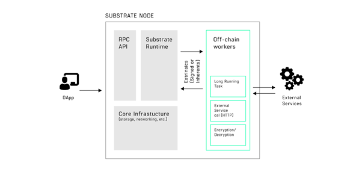
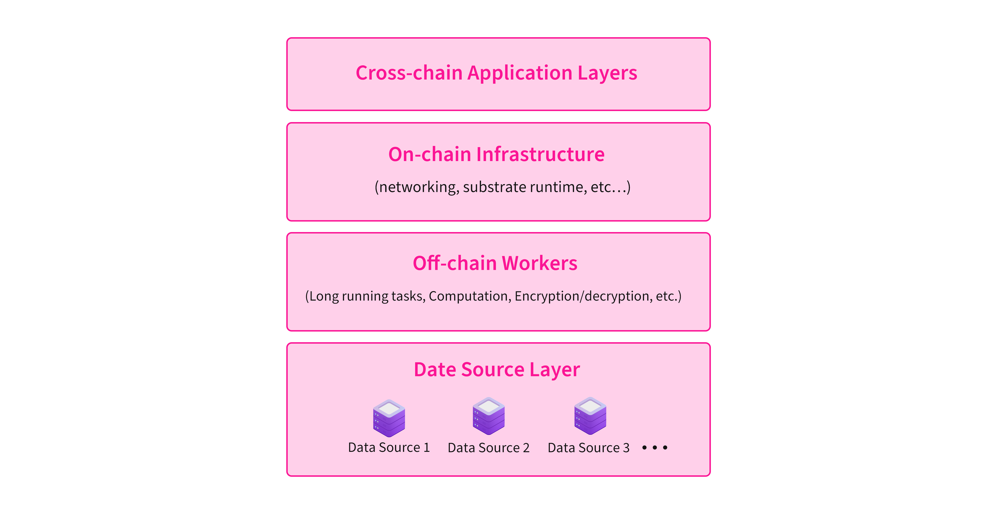

# Technology Architecture of PolkaOracle

A four-layer Technology Architecture

---

PolkaOracle is aiming to build a flexible, self-evolving oracle network based on Polkadot, providing applications or smart contracts with customized real-time on-chain data feeding services. PolkaOracle will adopt the Off-chain Workers architecture of the Substrate 2.0 to build an on-chain oracle system and is designed to be the parachain/parathread connecting to the Polkadot universe.

    
    
The architecture of off-chain worker (Data source: Parity)

PolkaOracle will be built on the groundbreaking technology with Substrate and surrounding tech stack to leverage the most cutting-edge features to develop a community-driven self-evolving oracle system. As demonstrated below, the 4-layer architecture of PolkaOracle consists of:

    
    
Technology Architecture of PolkaOracle

- **Data Source Layer**

    The Data Source Layer is the bottom layer of the entire oracle system. It is mainly responsible for obtaining third-party off-chain data through various API interfaces with preliminary screening, comparison and filtering of the data to ensure the authenticity, accuracy and real-time of the data.

- **Off-chain Workers**

    Off-chain Workers is a new feature in Substrate 2.0, allowing developers to integrate data safely and securely onto the blockchain applications. The Off-chain Worker for PolkaOracle will allow execution of expensive, long-running and private tasks such as the Computation-based Data Verification, the Web requests and the random number generation, etc., providing the security, efficiency and randomness of the data feed.

- **On-chain Infrastructure**

    The On-chain Infrastructure is responsible for the fully-deterministic and transparent on-chain logic which is processed by the entire network with a slower speed.  The on-chain infrastructure will ensure the security, fairness, transparency and finality of the entire network.

- **Cross-chain Application Layer**

    The Cross-chain Application Layer is the uppermost layer of the entire system. It mainly provides various general and customized data interfaces based on cross-chain technology for various applications that require oracle data services. In addition, this layer will also provide public tools such as user-defined oracle data calling templates and public data display panels.
