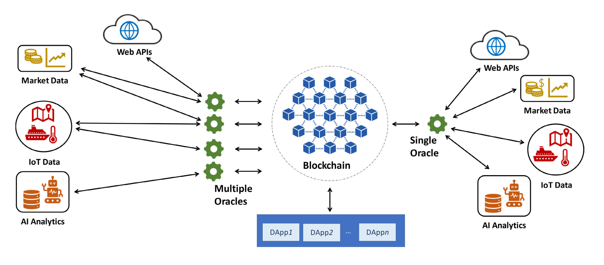

# Project Background

Why do we need PolkaOracle?

---

## Overview of Oracles

Within the blockchain context, an oracle is an agent that helps the blockchains to communicate with  multiple external sources to provide the on-chain smart contracts with accurate and reliable information. But blockchain is still in its infancy, and oracles hold the key to help smart contracts to sync a blockchain to record new off-chain information that is not determined by previous on-chain transactions.

Oracle is not just the off-chain data sources itself, but rather the intermediate layer that queries, verifies, authenticates, and relays external information, including the market data (such as price information), event information (such as real-time flight information) or other data sources measured by sensors. Besides, some oracles even have the ability to send the on-chain information back to external sources.

    
    
The role of oracles in blockchain systems(data source: reference #1)

According to the research of Binance Academy, almost all the blockchain oracles can be classified to 5 main types depending on three different qualities: source, direction of information, and trust.

- **Software Oracle**. Software oracles is one of the most common types of blockchain oracles, providing the blockchain with real-time online data resources, including online database, server, and websites.

- **Hardware Oracles**. A hardware oracle is designed to translate the information from the physical world(such as flight information or the supply chain data) into digital values, making it available to smart contracts or other on-chain components.

- **Inbound and outbound oracles**. Inbound and outbound oracles help the blockchain or the smart contracts interact with off-chain real world, like transmitting information from the external sources (such as a sensor) to the smart contracts and then sending it back to the off-chain objects such as a smart bicycle.

- **Centralized and decentralized oracles**. A centralized oracle is depending entirely on a single entity controlling the effectiveness of the oracle, while a decentralized increase the reliability of information by not  depending on a single data source.

- **Contract-specific oracles**. This type of oracle is designed to serve a specific case, hence giving the developers the highest flexibility to tailor them to specific requirements.

## The Oracle Problem

Oracles are the essential needs created by blockchain to collect and provide data feeds and input to smart contracts, serving as the information bridge between the sequential blockchains and other off-chain heterogeneous systems.  Although oracles bring the important data feeds into the blockchain, it is hard to guarantee the reliability of external data sources. The trust conflict between third-party oracles and the trustless execution of  smart contracts causes the “The Oracle Problem”. The compromised oracles will bring the corrupt, malicious, and incorrect data on the blockchain, leading to the compromised execution of on-chain smart contracts.

The ideal oracles must satisfy the following 3 keys:

- **Accuracy and Reliability**: All the data from the third-party oracles must truly reflect the external real world within the tolerance range, including the market price, temperature, and other IoT data. Besides, the oracles need to ensure reliable performance  on the blockchains with more responsible data feeding services.

- **Security and Privacy**: The interaction between unknown participants on-chain and off-chain could potentially raise the privacy and security concerns at both ends. A brand new mechanism is always required to eliminate the internal(e.g., DDOS attacks) and external security and privacy issues such as transmitting malicious and corrupt data to smart contracts.

- **Interoperability and scalability**: The oracles always act as the role of agent that finds and verifies the real-world data and values to the blockchain. However, Substrate, the underlying technology of Polkadot, gives users all the possibilities to build a customized blockchain in minutes. The era of blockchain networks, so-called WEB 3.0, will require the oracles to interact, collect, and transmit the real-time data feeds from other blockchains  in the near future.

---

## Why do we need an Oracle?

Decentralized applications based on smart contracts have huge potential and practical value due to their automated execution characteristics. The replacement of centralized intermediaries by trustless smart contracts will produce subversive innovations in traditional businesses. In the Web 2.0 era, centralized enterprises are the most profitable organizations in data storage, analysis and distribution fields. In Web3.0 era, the decentralized network can produce a paradigm shift, allowing users to regain their own data ownership and truly acquire the dominance of Internet.
However, decentralized applications run in a trustless manner, and many requirements from users still rely on external data sources. However, due to its own consensus model, the blockchain cannot directly import real-world data and information by actively initiating a network call action. The consensus mechanism of the blockchain determines that each node must reach the same state after the on-chain transaction and block data is processed. Therefore, even if the external data interface is arranged on chain to directly import data, these data will not be accepted because it cannot meet the consensus. Smart contracts currently do not have a simple way to access reliable real-world data, which makes their application scenarios quite limited. Current decentralized applications still rely on centralized data services to provide data, which means that the meaning of decentralization is lost at the data level in the beginning.
