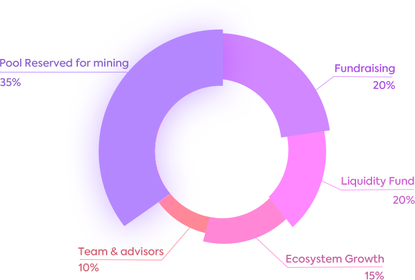

# Token Metrics & Distribution

Info on POT tokens and how you can get them.

---

## Token Metrics

*The token metrics are detailed below:*

**Ticker: POT**

**Total Supply: 21M**

    
    
Token Distribution Chart

- **Ecosystem Growth: 15%** of the total supply; reserved for marketing, partnership and exchange listing, vesting through a 3-year period

- **Team & Advisors: 10%** of the total supply; 10% on listing, then vesting through a 3-year period

- **Liquidity Fund: 20%** of the total supply; reserved for the fund for liquidity on Uniswap and other exchanges, vesting through a 3-year period

- **Pool Reserved for Mining: 35%** of the total supply; reserved for the network incentives after the launchment of mainnet.

- **Fundraising: 20%** of the total supply:

<table style="display: table;text-align: left;">
    <thead>
        <tr style="border-bottom: 1px solid #ccc;">
            <th style="border: none; color: #ccc;">Round</th>
            <th style="border: none; color: #ccc;">Price</th>
            <th style="border: none; color: #ccc;">Allocation</th>
            <th style="border: none; color: #ccc;">Release Policy</th>
        </tr>
    </thead>
    <tbody>
        <tr style="border-bottom: 1px solid #ccc;">
            <td style="border: none;">Seed Round</td>
            <td style="border: none;">$0.1 USD</td>
            <td style="border: none;">5% of total supply</td>
            <td style="border: none;">20% vesting on listing, then 8% monthly over 10 months</td>
        </tr>
        <tr style="border-bottom: 1px solid #ccc;">
            <td style="border: none;">Private Round</td>
            <td style="border: none;">$0.2 USD</td>
            <td style="border: none;">10% of total supply</td>
            <td style="border: none;">30% vesting on listing, then 12% monthly over 5 months</td>
        </tr>
        <tr style="border-bottom: 1px solid #ccc;">
            <td style="border: none;">Seed Round</td>
            <td style="border: none;">$0.4 USD</td>
            <td style="border: none;">5% of total supply</td>
            <td style="border: none;">No Lock-up</td>
        </tr>
    </tbody>
</table>

POT tokens will be vested through a 3-year period to better ensure the value basis of POT tokens. 

PolkaOracle will seek more solid value basis enforcements such as business development, user growth, community growth and ecosystem construction, etc. 

## A Deflationary Mechanism

Token supply deflation is a mechanism that ensures that the company can generate demand for tokens in the market, and reduce supply at the same time.

Certain proportions of POT tokens will be bought back and burnt using the commission fees during the applications of data feeds by our users. The buy-backs will be carried out on regular basis. 

With demands for data feeds from PolkaOracle increase, there will be more revenue to ensure the sustainable growth of POT values. 
