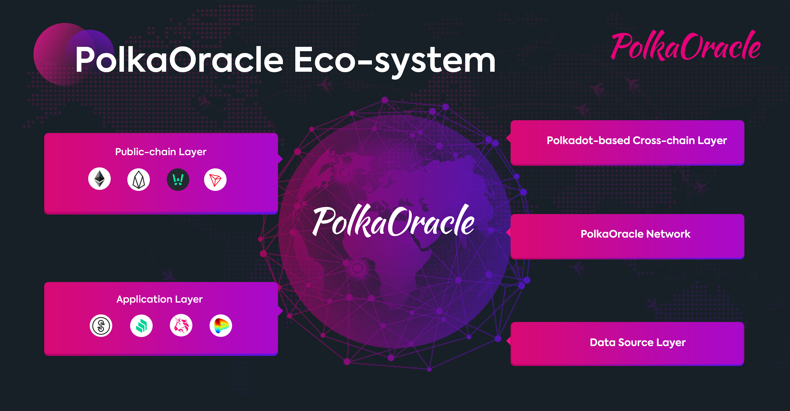

# Key Features of PolkaOracle

PolkaOracle Technology Advantages

---

## Technology Advantages

Compared with other oracle systems such as Chainlink, PolkaOracle owns a unique design concept and system architecture, able to provide blockchain applications with data services that integrate important features like cross-chain interoperability, scalability, real-time feeding, and self-evolution into the system. The key features are detailed below:

- **Built-in On-chain Oracle**

    PolkaOracle will be built on the “Off-chain Worker” module of Substrate 2.0 to leverage Substrate nodes to perform advanced computation and data feeding entirely on-chain. The new feature of Substrate 2.0 would allow developers to build and unload more complex operations including web request, price feed, advanced computation and other CPU-intensive tasks.

- **Self-Evolution**

    PolkaOracle is a dynamic self-evolving ecosystem driven by community power and cutting-edge computable network technology. The VRF-based challenge mechanism will continuously optimize the data feeding model in the entire network, so as to provide increasingly accurate and reliable data support and verification services.

- **Scalability and Interoperability**

    Created for maximum flexibility and reliability, PolkaOracle will be built on Substrate, the groundbreaking blockchain development framework from Parity, sharing the same key features with Polkadot, including scalability, security and interoperability, etc.. 

- **Real-time Data Feeding**

    PolkaOracle adopted the built-in development module of Substrate 2.0, enabling the applications who called up the oracle service with credible and reliable real-time data feeding through the trustless on-chain operations such as on-chain computation, encryption and decryption, data verification and randomly challenge.

## Eco-system of PolkaOracle

As the Technology Architecture of PolkaOracle is composed of Public-chain Layer to enable fully-deterministic and transparent on-chain logic which is processed by the entire network with a slower speed; Off-chain Layer allowing developers to integrate data safely and securely onto the blockchain applications; Polkadot-based Cross-chain Layer providing various general and customized data interfaces based on cross-chain technology for various applications that require oracle data services as well as Data-source Layer for data obtaining, PolkaOracle's eco-system is comprehensively composed of four pivotal components: Public-chains, Application, Data Providers and Polkadot-based Network. 

The Eco-system of PolkaOracle is ever-evolving and growing with the continuous development of PolkaOracle's business expansion and application popularization. 

    

