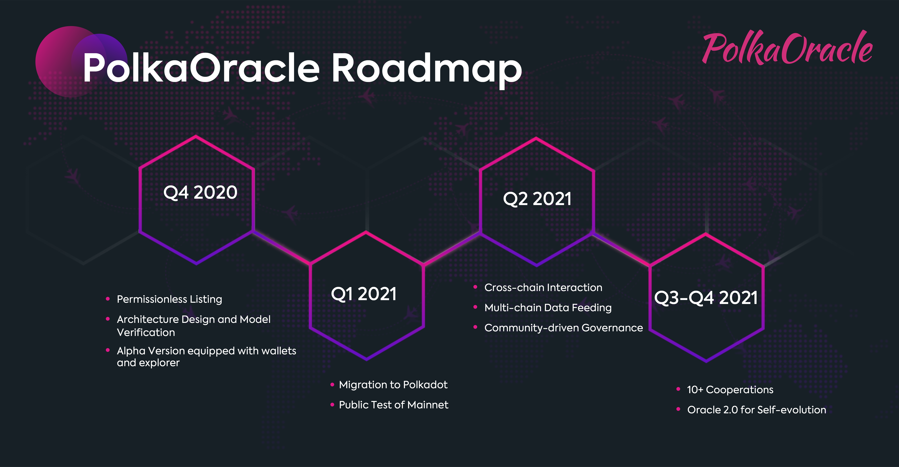

# Work in the Future

What can we expect for PolkaOracle in the future.

---

## Future Technology Developments

With the recent rapid development of DeFi, it is foreseeable that the blockchain will explode on a large scale in the future. In order to effectively respond to future market demands, PolkaOracle will strengthen its capability from the following aspects:

- **L2 Solutions**

    Due to the intrinsic limitations of the blockchain system architecture, the L2 solutions will play a pivotal role in data processing, privacy protection, and diversity in the future. Therefore, PolkaOracle will actively research leading L2 technologies such as zk-rollup technology to ensure that the entire oracle system can always meet the diverse and specialized requirements of the application layer.

- **Privacy Protection Technology**

    As the application fields of the oracle continue to expand, more applications in the future will place stricter requirements on privacy protection. Therefore, PolkaOracle will concentrate its development efforts on research and development of private protection technologies including homomorphic encryption technology, secure multi-party computation (MPC) technology and zero-knowledge proof.

- **Unstructured Data Support**

    Up to now, oracle projects on the market are mainly designed for structured data, such as market price data. However, in the real business environment, the demand for unstructured data is also a huge market demand. Therefore, PolkaOracle will study the collection, processing and verification technology of unstructured data in advance to gain a leading competitive advantage.

- **Self-evolution Mechanism**

    PolkaOracle aims to create a flexible self-evolving system possessing true self-evolution and self-organization capabilities. Therefore, we will actively cooperate with the world’s leading technology companies and universities to conduct extensive research on the combination of blockchain and self-evolving technologies including neural networks.

## Quarterly Roadmap

Due to the rapid development of blockchain technology, the scheduled roadmap of this project is shown as below. This roadmap is for reference only and will be adjusted according to the needs of project development.

    
    
PolkaOracle Roadmap

- **Q4 2020**

    Permissionless Listing

    Architecture Design and Model Verification

    Alpha Version equipped with wallets and explorer

- **Q1 2021**

    Migration to Polkadot

    Public Test of Mainnet

- **Q2 2021**

    Cross-chain Interaction

    Multi-chain Data Feeding

    Community-driven Governance

- **Q3-Q4 2021**

    10+ Cooperations

    Oracle 2.0 for Self-evolution
