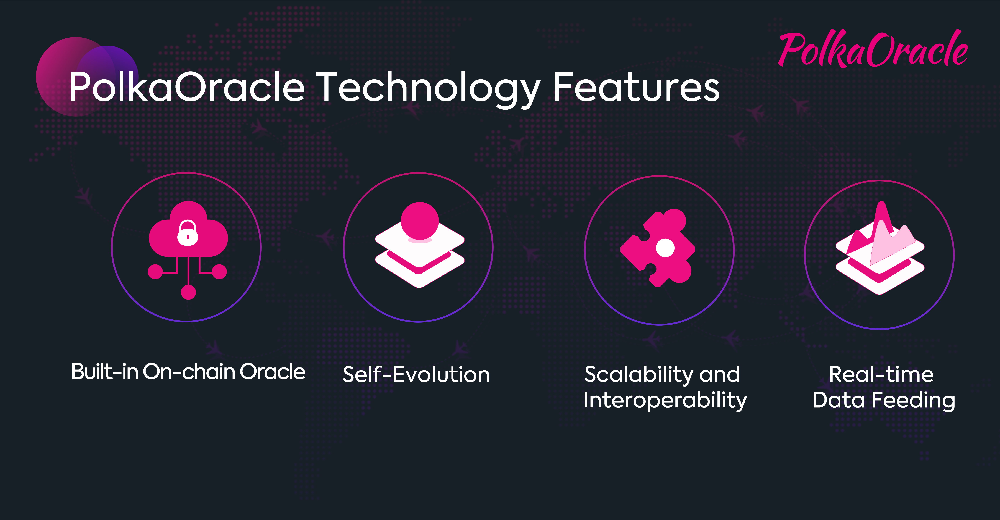

# Introducing PolkaOracle

Oracle System built on Polkadot to empower applications beyond DeFi

---

**PolkaOracle is a flexible, self-evolving oracle network built on Polkadot, providing applications or smart contracts with customized real-time on-chain data feeding services.**

In the blockchain industry, the oracle problem is the need that blockchain created, which stems from the heterogeneous architecture of the blockchain different from the traditional computer systems. For any blockchain-based systems, any on-chain data and events are deterministic, requiring that the external data must be sufficiently credible, reliable and accurate for the data security and accuracy.

The recent DeFi hype in the market has greatly highlighted the importance of the oracle system: for all emerging industries based on the blockchain, whether it is DeFi or prediction markets, or supply chain finance, the prosperity of these industries all have put forward strict requirements on reliable, credible, secure and real-time oracle systems. With the expansion of blockchain applications, it is foreseeable that the demand for oracles will increase in the future, and the requirements for off-chain data will become more diversified and specialized.

    
    
Technology Features of PolkaOracle

