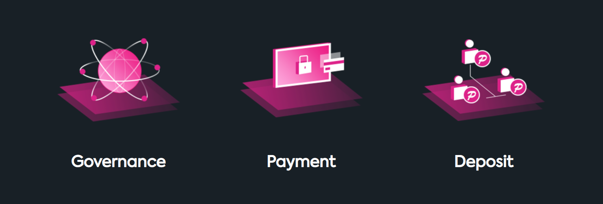

# Tokenomics

Token Economics and Use Cases

---

## Incentives and Economics

POT is the native utility token in PolkaOracle network, which is used to pay the data providers (Substrate nodes)  for the transaction fees and data feeding services and also for the deposits of any on-chain applications. Besides, the POT holders will be able to vote on proposals from the community and even decide how the ecosystem fund will be used in PolkaOracle. The main utilities of native token POT is classified as follows:

- **Governance**

    Only the community members holding POT tokens have the right to participate in the governance of the entire oracle network, including voting on the addition of sub-contracts or system upgrade proposals. In addition, POT holders can also make changes to the entire network by independently initiating community proposals, but they must also obtain the consent of more than 1/3 network nodes.

- **Payment**

    POT is the only payment medium and value unit in the entire network. The data demander needs to pay POT tokens to the data provider and verification node when initiating a data request.

- **Deposit**

    POT will also act as the only mortgage asset in the entire network. As long as community members pledge enough POT tokens and meet the hardware requirements for node operation, they can join the entire oracle network freely and participate in tasks such as data collection, data verification, or block packaging in the network.

    

