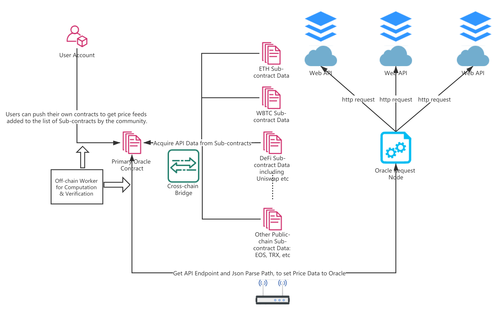

# Workflow of Data Request

Concise Demonstration of PolkaOracle Workflow

---

    
    
Work-flow of Data Request

A concise demonstration of PolkaOracle's workflow is as follows：

1\) When the user initiates a data request, the substrate network node will obtain the original data through a third-party verifiable data API such as a website API. After basic screening, comparison and preliminary verification of the node network, the raw data will be submitted to the off-chain worker layer for further data verification.

2\) The off-chain worker for verification will randomly select network nodes through the VRF algorithm for off-chain calculation and verification, and then comprehensively compare the verification results. If the verification proves that the submitted data is wrong or tampered, the node submitting the data will be punished by slash. The confiscated mortgage assets will be equally rewarded to network nodes that find the data errors.

3\) The data verified by the off-chain worker will be confirmed by the entire blockchain, then the data will be transmitted in real time to the application that initiated the data request through cross-chain interoperability technology.

4\) For application users, they can simplify the data feeding process and increase the data transmission speed by deploying sub-contracts and being added to the list of Sub-contract by the community through voting.
